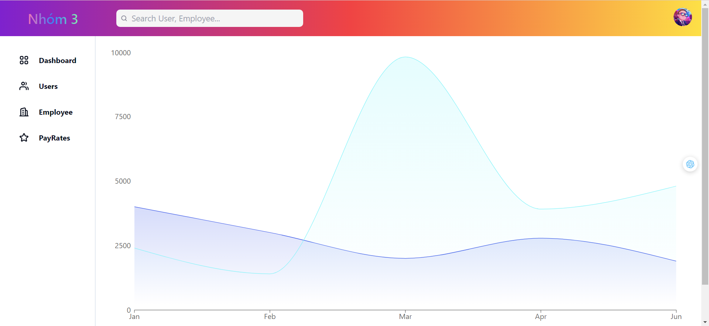

# Project case 3: Frontend.

## Class: CS455I

## Clone project:

`git clone https://github.com/vothanhphuoc/case3-frontend.git`

## Instructions:

# cmd and bash:

```
pnpm install
pnpm run start
```

### Libraries: ReactJS, Tailwindcss, Shadcn ui, Axios.

### Preview:



## Main function:

`CRUD`
